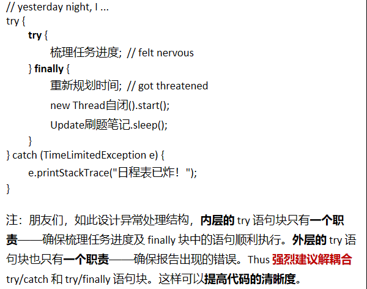

# MarkDown基础

## 标题

~~~maarkdown
#标题名字（井号的个数代表标题的级数）
~~~

# 一级标题使用1个#

## 二级标题使用2个#

### 三级标题使用3个#

#### 四级标题使用4个#

##### 五级标题使用5个#

###### 六级标题使用6个#

## 一、文字

### 删除线

~~~markdown
这是 ~~删除线~~ （前后两个~)
~~~

这是 ~~删除线~~ 


### 斜体

~~~markdown
这是用来 *斜体* 的 _文本_
~~~

这是用来 *斜体* 的 _文本_

### 加粗

~~~markdown
这是用来 **加粗** 的 _文本_
~~~

这是用来 **加粗** 的 _文本_

### 斜体 + 加粗

~~~markdown
这是用来 ***斜体+加粗*** 的文本
~~~

### 下划线
下划线是 HTML 语法
下划线 <u>下划线（快捷键 Ctrl + u）</u> 

### 高亮（需勾选扩展语法）

~~~markdown
这是用来 ==高亮== 的文本
~~~

这是用来 ==高亮== 的文本

### 下标（需勾选扩展语法）

~~~markdown
水 H~2~O
双氧水 H~2~O~2~
~~~

水 H~2~O
双氧水 H~2~O~2~

氢气 H~2~

### 上标（需勾选扩展语法）

~~~markdown
面积 m^2^
体积 m^3^
~~~

面积 m^2^

体积 m^3^

### 表情符号

Emoji 支持表情符号。输入 `:`将会有智能提示。

#### 一些表情例子

~~~ markdown
:smile: :laughing: :dizzy_face: :sob:  
~~~

:smile: 


### 表格

使用 `|` 来分隔不同的单元格，使用`-`来分隔表头和其他行
~~~markdown
name | price
--- | ---
fried chicken | 19
cola | 5
~~~

> 为了使 Markdown 更清晰，`|` 和 `-` 两侧需要至少又要给空格（表格最左最右侧的 `|` 可以不加空格）

| name | price |
| --- | --- |
| fried chicken | 19 |
| cola | 5 |

> 为了美观，可以使用空格对齐不同行的单元格，并在左右两侧都使用 `|` 来标记单元格边界。
>
> 在表头下方的分隔线标记中加入 `:` ，即可标记下方单元格内容的对齐方式（左、居中、右）：

~~~markdown
| name | price |
| :--- | :---: |
| fried chicken | 19 |
| cola | 32 |
~~~

| name | price |
| :--- | :---: |
| fried chicken | 19 |
| cola | 32 |

> 使用快捷键 `Ctrl` + `T` 可以快速插入表格


### 引用

~~~markdowm
> 引用内容
>> 嵌套引用（增加层次）
~~~

> 引用内容
>
> > 嵌套引用

---


## 二、列表

### 无序列表（起始符号 + 空格）

~~~markdown
* 可以用 `*` 作为起始符
+ 也可以用 `+` 作为起始符
- 也可以用 `-` 作为起始符
~~~

* 可以用 `*` 作为起始符

+ 也可以用 `+`作为起始符

- 也可以用 `-` 作为起始符


### 有序列表（数字 + `.` + 空格）

1. 有序列表以数字和 `.` 开始；
2. 数字的序列并不会影响生成的列表序列

4. 推荐按正常顺序编写有序列表
   1. 我是嵌套列表
   2. 嵌套列表第二条
      1. 按 `Tab` 键开始嵌套列表 

4. 外层继续

---


## 三、代码

### 代码块

~~~markdown
```语言名称(也可以只输入```，出现代码块后在右下角自行选择语言)
~~~

```java
public static void main(String[] args) {
    System.out.println("Hello world!");
}
```

### 行内代码

~~~ markdown
也可以通过 `` 插入行内代码
例如： `java`
~~~

例如 `java` 

### 转换规则

代码块中的文本（包括 Markdown 语法）都会显示为原始内容

---


## 四、分隔线

***

可以在一行中使用三个或更多的`*`、`-`或`_`添加分隔线：

---

---

___


## 五、跳转

> 注：在（Linux / Windows系统） Typora 内可以通过 **Ctrl + 单击连接** 跳转至目标网页或段落

### 外部跳转——超链接

格式为`[link text](link)` 

~~~markdown
[帮助文档](https://support.typora.io/Links/#faq)
~~~

[帮助文档](https://support.typora.io/Links/#faq)


### 内部跳转——本文件内跳（Typora支持）

格式为 `[link text](#要去的目的地——标题)`。

~~~markdown
[跳转至本文件的标题一、文字](#一、文字)
~~~

[跳转至本文件的标题一](#一、文字)


### 自动连接

使用 `<>` 括起来的 URL 或邮箱地址会被自动转换为超链接

~~~markdowm
<https://www.baidu.com>
~~~

 <https://www.baidu.com>

---


## 六、图片

~~~markdown

~~~




